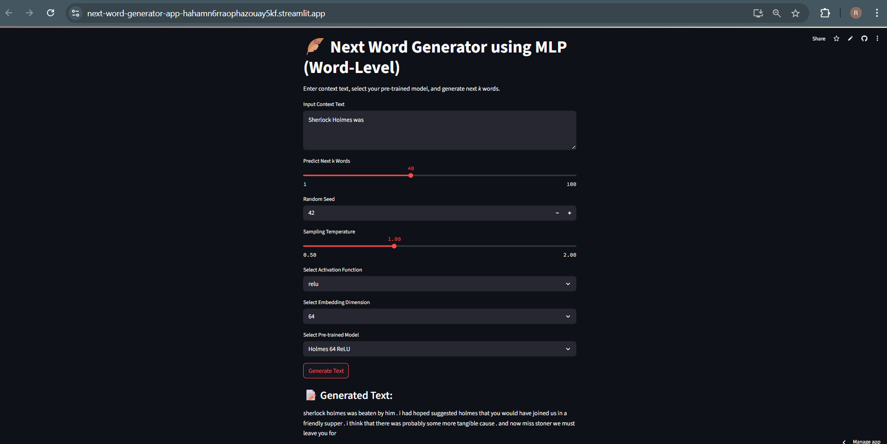

# Next Word Generator (Streamlit)

Generate the **next _k_ words** given a context using a **word-level MLP language model** with a clean, interactive **Streamlit interface**.

## Live Demo

[Click here to try the app live](https://next-word-generator-app-hahamn6rraophazouay5kf.streamlit.app/)

---
## Preview



## Features

- Word-level MLP next-word generation
- Adjustable `k`, temperature, activation, embedding dimension, and seed
- Supports multiple pre-trained models (Holmes, Shakespeare, Tolstoy)
- Minimal, clean Streamlit UI
- Easy to extend to your datasets
- Works on GPU or CPU

---

## Repository Structure

```
next-word-generator-streamlit/
│
├── app.py               # Streamlit app
├── requirements.txt     # Dependencies for deployment
├── models/              # Pre-trained .pt models
├── datasets/            # Raw datasets used for training
├── modelTraining/       # Jupyter notebooks for training
└── README.md            # This file
```

---

## How It Works

1. **Input context** (e.g., `"To Sherlock Holmes she is always the woman"`).
2. Choose:
   - Activation function
   - Embedding dimension
   - Pre-trained model
   - Number of words to predict (`k`)
   - Temperature for sampling
3. Click **Generate Text**.

The MLP model predicts one word at a time using the current context, updating it iteratively for `k` steps with **multinomial sampling**. Temperature scaling adjusts diversity for creativity.

---

## Local Setup

### 1️⃣ Clone the Repository

```bash
git clone https://github.com/Revathi-katta/Next-Word-Generator-Streamlit.git
cd Next-Word-Generator-Streamlit
```

### 2️⃣ (Optional) Create a Virtual Environment

```bash
python -m venv .venv

# Windows
.venv\Scripts\activate

# Mac/Linux
source .venv/bin/activate
```

### 3️⃣ Install Dependencies

```bash
pip install -r requirements.txt
```

### 4️⃣ Run the Streamlit App

```bash
streamlit run app.py
```


##  Developed By

**Revathi Katta**  
B.Tech @ IIT Gandhinagar
[GitHub](https://github.com/Revathi-katta)
